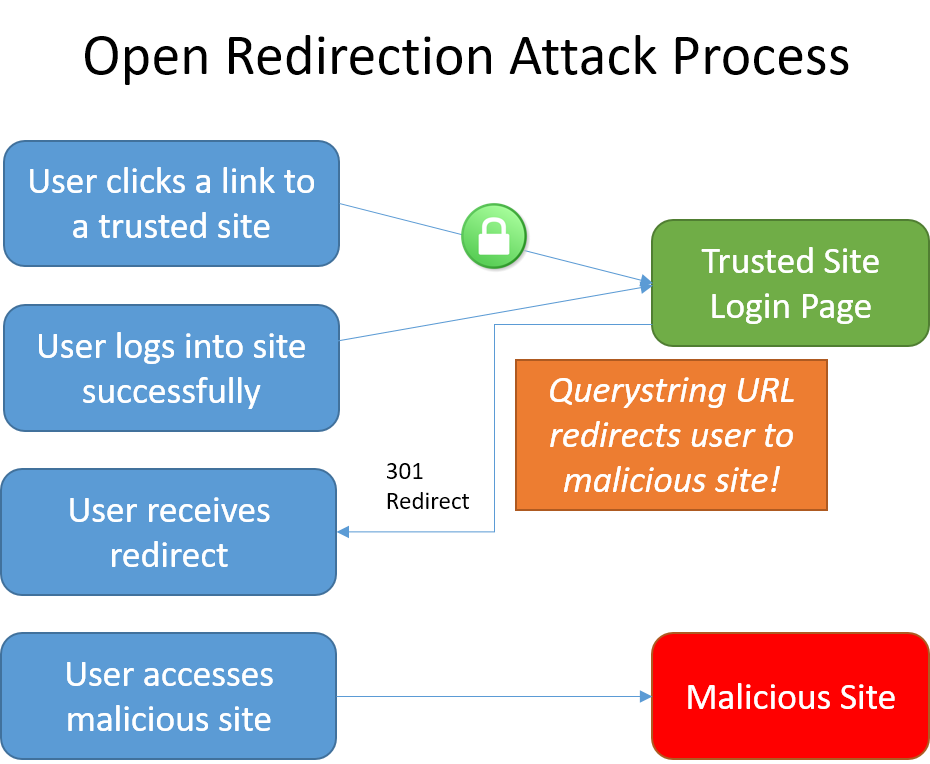

# Preventing Open Redirect Attacks in an ASP.NET Core app

ASP.NET Core has built-in functionality to help protect apps from open redirect (also known as open redirection) attacks. This article describes:

- What is an open redirect attack?
- Protecting against open redirect attacks

## What is an open redirect attack?

A common pattern in web applications, especially when a login is required, is to specify a redirect URL through the querystring. In this way, an unauthorized user attempting to access a particular resource can be redirected to a login page with their intended destination included in the URL string. Once they successfully authenticate, the user can be redirected to the URL they had originally requested. However, since the destination URL is simply specified in the querystring of the request, a malicious user could tamper with the querystring, allowing the site to redirect the user to an external, malicious URL. This technique is called an open redirect (or redirection) attack.

### An example attack

A malicious user could develop an attack intended to allow them access to a user's credentials or information your app manages. To begin the attack, they convince the user to click a link to your site's login page, with a `returnUrl` querystring value added to the URL. For example, the [NerdDinner.com](http://nerddinner.com) sample application (written for ASP.NET MVC) includes such a login page here: ``http://nerddinner.com/Account/LogOn?returnUrl=/Home/About``.

If you navigate to the link above and log in, you should be redirected to the site's [About page](http://nerddinner.com/Home/About). Imagine an attack designed to gain access to a user's credentials. The attacker would create a page that matched the look of the target app, and would most likely use a similar domain name as well (e.g. nerddiner.com, with a single 'n'). Then the attacker would get an unsuspecting user to navigate to a page requesting them to change their password, using a URL like this: ``http://nerddinner.com/Account/LogOn?returnUrl=http://nerddiner.com/Account/LogOn``. After successfully logging in, the user will see the page reload and they'll be prompted to log in once more. Most likely, they'll think their first attempt had a mistake, and they will try again. The attacker will now receive the user's credentials, and can redirect the user back to the original, legitimate site so the user is unaware the attack took place.



## Protecting against open redirect attacks

When developing web applications, you must always treat user-provided data as untrustworthy. This definitely includes querystring data. If your application has functionality that redirects the user based on the contents of the URL, you should ensure that such redirects are only done locally within your app (or to a known URL, not any URL that may be supplied in the querystring). ASP.NET Core provides an [IUrlHelper](https://docs.microsoft.com/aspnet/core/api/microsoft.aspnetcore.mvc.iurlhelper) interface accessible in MVC apps from [ControllerBase](https://docs.microsoft.com/aspnet/core/api/microsoft.aspnetcore.mvc.controllerbase)'s Url property. you can request through DI, which has an ``IsLocalUrl`` method you can call to test URLs before redirecting to them.

The following example demonstrates how to check whether a URL is local before redirecting the user.

```
private IActionResult RedirectToLocal(string returnUrl)
{
    if (Url.IsLocalUrl(returnUrl))
    {
        return Redirect(returnUrl);
    }
    else
    {
        return RedirectToAction(nameof(HomeController.Index), "Home");
    }
}
```

If the URL provided is not a local URL, the user is redirect to the site's home page instead of to the URL provided. This protects users from being inadvertently redirected to a malicious site. You may also wish to log the details of the URL that was provided when a non-local URL is supplied in a situation where you expected a local URL, as this may help in diagnosing other attacks being made against your app.

## Summary

Open redirect attacks use built-in redirection in your web app to send users to a malicious web site (often disguised to look like your app). This most often occurs as part of your app's login process. To protect against open redirection attacks, you should always confirm the URL to which you're redirecting is local to your app before redirecting the user.

